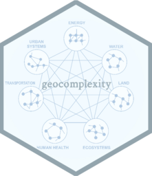

``` r
library(showtext)
showtext_auto(enable = TRUE)
font_add("ShineTypewriter", regular = "./ShineTypewriter-lgwzd.ttf")
library(hexSticker)
library(magick)

sticker(
  subplot = "./bg2.png",
  s_x = 0.990,
  s_y = 1.165,
  s_width = .50,
  s_height = .50,
  package = "geocomplexity",
  p_family = "ShineTypewriter",
  p_size = 10.5,
  p_color = ggplot2::alpha("#efd298",.95),#ggplot2::alpha("#3e3221",.75),
  p_x = 1.00,
  p_y = 0.585,
  dpi = 300,
  asp = 1,
  h_size = 1.75,
  h_color = ggplot2::alpha("#efd298",.95),#ggplot2::alpha("#8297a0",.95),
  h_fill = ggplot2::alpha('#172a38',1),
  white_around_sticker = F,
  url = "https://ausgis.github.io/geocomplexity",
  u_color = ggplot2::alpha("#efd298",.95),
  u_size = 4.2,
  filename = "geocomplexity_logo.png"
)

image_read('./geocomplexity_logo.png') |> 
  image_resize("256x256")|> 
  image_write('./geocomplexity_logo.png')
```


